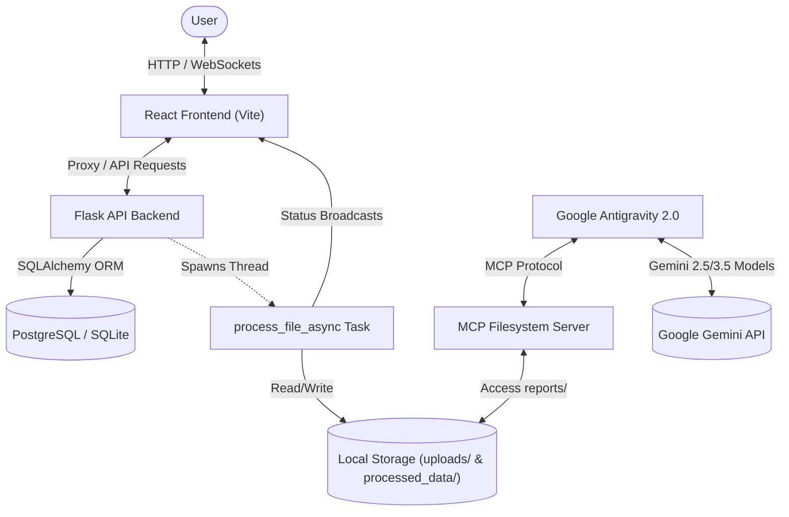
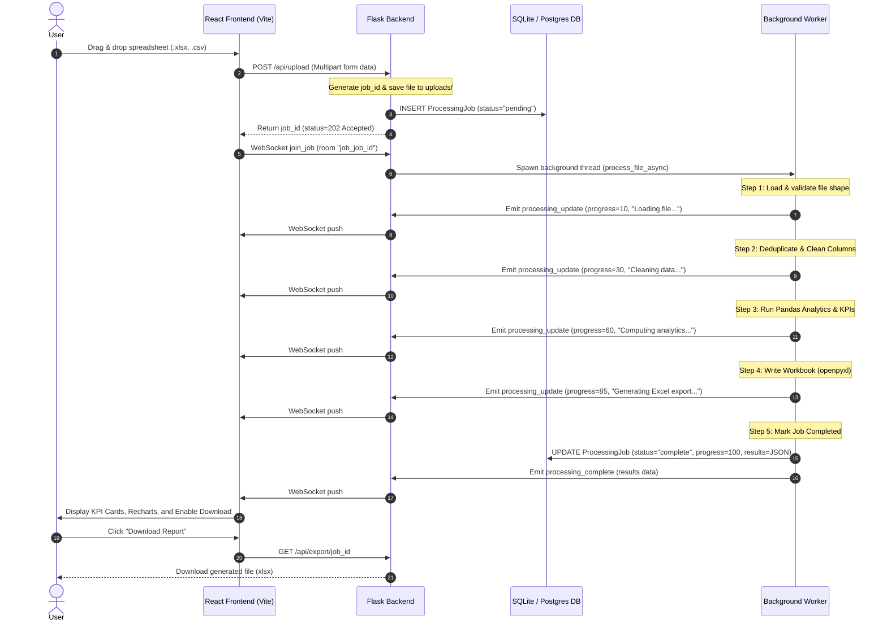
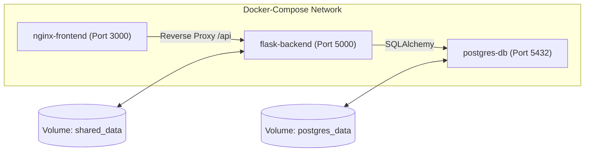

# Excel Analytics Suite — System Design & Architecture

## System Overview

The Excel Analytics Suite is a high-performance, containerized full-stack platform designed to clean, analyze, and visualize large datasets (exceeding 100,000+ rows). The system delivers end-to-end processing through two main components:
1. **Interactive Dashboard**: A real-time web application built with **React** + **Vite** and a **Flask** background worker, leveraging **WebSockets** (Socket.IO) for live status reporting.
2. **Antigravity 2.0 Pipeline**: An automated reporting infrastructure utilizing **Python** scripts coupled with **Google Antigravity 2.0** agents via the Model Context Protocol (MCP).

---

## Architecture Diagrams

### 1. System Interaction Flow

The high-level interaction between the user interface, backend processing, persistent database, and AI agent platform:



### 2. File Upload & Async Processing Sequence

The sequence of events from when a file is dropped in the UI to when the finalized analysis and Excel reports are ready:



### 3. Docker Network & Container Infrastructure



---

## Technology Stack

| Layer | Component | Version | Functional Purpose |
| :--- | :--- | :--- | :--- |
| **Frontend Core** | React | `^19.2.6` | Component-based UI structure and user interface. |
| | React-DOM | `^19.2.6` | Native web renderer for React. |
| **Frontend Tooling** | Vite | `^8.0.12` | Next-generation frontend tooling and bundler. |
| | ESLint | `^10.3.0` | JavaScript/React static analysis and linting. |
| **WebSockets** | Socket.IO Client | `^4.8.3` | Bidirectional websocket client for real-time progress. |
| **Visualizations** | Recharts | `^3.8.1` | Dynamic SVG line and bar charts. |
| **Backend Core** | Flask | `^3.x` | Lightweight REST API endpoint router. |
| **Real-time Engine**| Flask-SocketIO | `^5.x` | Bidirectional websocket integration for Flask. |
| **ORM** | SQLAlchemy | `^2.x` | Relational Database Object-Relational Mapper. |
| **Data Engine** | Pandas | `^2.x` | High-performance cleaning, aggregates, and analysis. |
| | OpenPyXL | `^3.x` | Spreadsheet file formatting, formulas, and chart engine. |
| **Databases** | SQLite / PostgreSQL | `3.x` / `15` | Metadata store for job tracking and historical run logs. |
| **Automation** | Google Antigravity | `2.0` | Desktop AI agent runner for scheduled task pipelines. |
| **AI Models** | Google Gemini | `2.5` / `3.5` | Multi-modal reasoning models powering analysis. |

---

## Frontend Architecture & Configuration

### 1. Build and Transpilation Analysis

Based on the [README.md](file:///d:/Projects/IT-Kill/excel-dashboard/frontend/README.md) analysis, the frontend is built using **React 19** + **Vite 8**, which includes the following characteristics:

- **React Compiler Excluded**: The React Compiler is explicitly **not** enabled on this setup due to its measurable overhead on development server start and production bundle compilation times. 
- **Vite Plugins & Transpilers**: The system uses the official `@vitejs/plugin-react` plugin which is optimized for [Oxc](https://oxc.rs) to handle fast JavaScript parsing and JSX transformation. An alternative path is to use `@vitejs/plugin-react-swc` utilizing the Rust-based [SWC compiler](https://swc.rs/).
- **Linting & Code Quality**: Managed via ESLint 10, utilizing `@eslint/js`, `eslint-plugin-react-hooks`, and `eslint-plugin-react-refresh`. For production stability, type-aware lint rules can be enabled by migrating to the TS template incorporating `typescript-eslint`.

### 2. Development Dev Server Proxying

Vite’s developer proxy is configured in [vite.config.js](file:///d:/Projects/IT-Kill/excel-dashboard/frontend/vite.config.js) to transparently route request targets:
- `/api` requests are proxied directly to `http://localhost:5000` (Flask).
- `/socket.io` WebSocket handshakes are proxied with websocket support enabled (`ws: true`).
This mitigates CORS issues entirely during local development, keeping production configurations consistent.

### 3. Component Breakdown

The React components are structured hierarchically under `src/components/`:

- **[FileUpload.jsx](file:///d:/Projects/IT-Kill/excel-dashboard/frontend/src/components/FileUpload.jsx)**: Handles file drops, local mime-type check (`xlsx`, `xls`, `csv`), size verification, and initiates multipart/form-data upload.
- **[ProcessingStatus.jsx](file:///d:/Projects/IT-Kill/excel-dashboard/frontend/src/components/ProcessingStatus.jsx)**: Manages WebSocket listeners (`processing_update`, `processing_complete`, `processing_error`). Subscribes to the specific room corresponding to the upload's `job_id` using `join_job`.
- **[KPICards.jsx](file:///d:/Projects/IT-Kill/excel-dashboard/frontend/src/components/KPICards.jsx)**: Auto-detects and displays top-level KPIs such as total/average revenue, total orders, and profit margin dynamically computed by the backend.
- **[Charts.jsx](file:///d:/Projects/IT-Kill/excel-dashboard/frontend/src/components/Charts.jsx)**: Consumes structured arrays from backend results to render monthly trends via a curve line chart and regional distributions via a bar chart.
- **[DataTables.jsx](file:///d:/Projects/IT-Kill/excel-dashboard/frontend/src/components/DataTables.jsx)**: Generates paginated lists of data columns and handles preview grids.

---

## Backend Engine & Workflows

### 1. Database Model & Persistence

The backend defines a single relational entity in [database.py](file:///d:/Projects/IT-Kill/excel-dashboard/backend/modules/database.py):

```python
class ProcessingJob(db.Model):
    __tablename__ = "processing_jobs"
    id = db.Column(db.Integer, primary_key=True)
    job_id = db.Column(db.String(255), unique=True, nullable=False, index=True)
    filename = db.Column(db.String(255), nullable=False)
    status = db.Column(db.String(50), default="pending")  # pending, processing, complete, error
    progress = db.Column(db.Integer, default=0)
    total_rows = db.Column(db.Integer)
    total_columns = db.Column(db.Integer)
    created_at = db.Column(db.DateTime, default=datetime.utcnow)
    updated_at = db.Column(db.DateTime, default=datetime.utcnow, onupdate=datetime.utcnow)
    results = db.Column(db.JSON)
    error_message = db.Column(db.String(1000))
```

- **SQLite** is used for light, zero-dependency local development (`reports.db`).
- **PostgreSQL 15** is utilized for production-grade, multi-user deployments.

### 2. Async Data Processing Pipeline

When a file is uploaded, an async thread execution is triggered via [data_processor.py](file:///d:/Projects/IT-Kill/excel-dashboard/backend/modules/data_processor.py):

1. **File Loading & Check (`load_file`, `validate_file`)**: Loads data via `pd.read_csv` or `pd.read_excel`. Rejects empty files or files missing rows.
2. **Sanitization (`clean_dataframe`)**: 
   - De-duplicates exact rows.
   - Normalizes column names (converts to lowercase, strips spaces, replaces non-alphanumeric chars with `_`).
   - Coerces date/time strings to pandas Datetime objects.
   - Fills null numerical columns with `0` and text columns with `"UNKNOWN"`.
3. **Metric Calculation (`compute_analytics`)**:
   - Calculates total/avg/max/min for the first 5 numerical variables.
   - Automatically searches for typical column candidates (like `revenue`, `cost`, `order_id`, `region`) to build standardized sales and geographical performance models.
   - Computes dynamic monthly aggregations and a null percentage data-quality score.
4. **Excel Export Compilation (`generate_export`)**: Writes the finalized clean sheet data (up to the first 1000 rows) and a summary sheet to `processed_data/{job_id}_export.xlsx`.
5. **WebSocket Status Broadcasting**: Pushes progress logs (10%, 30%, 60%, 85%, 100%) through [socketio_handler.py](file:///d:/Projects/IT-Kill/excel-dashboard/backend/modules/socketio_handler.py).

---

## Antigravity 2.0 Agent Integration

For automated enterprise reporting, the system integrates directly with **Google Antigravity 2.0**:

### 1. Model Context Protocol (MCP) Bridge
Antigravity connects directly to the server's output files via the filesystem server (`@modelcontextprotocol/server-filesystem`). 
The configuration file at `~/.gemini/config/mcp_config.json` exposes the generated exports:
```json
{
  "mcpServers": {
    "data-files": {
      "command": "npx",
      "args": [
        "@modelcontextprotocol/server-filesystem",
        "C:/absolute/path/to/excel-dashboard/processed_data"
      ]
    }
  }
}
```

### 2. Automated Scheduled Workflows
Antigravity executes end-to-end cleaning and templating runs using defined JSON specifications. The pipeline scheduler loads:
- [refresh_report.py](file:///d:/Projects/IT-Kill/excel-dashboard/pipeline/refresh_report.py): Core workflow executor that cleans the raw source, runs analytical aggregate tasks, and writes output spreadsheets.
- [pipeline_runner.py](file:///d:/Projects/IT-Kill/excel-dashboard/pipeline/pipeline_runner.py): Wraps the pipeline with advanced file logging, return codes, and error trace trackers.
- **Task Scheduling**: Configured in `weekly_report.json` to trigger an agent at a specified cron period (e.g. `0 7 * * 1` for Monday at 7:00 AM) to query the files, analyze the anomalies, and compile a text summary.

### 3. Parallel Multi-Agent Orchestration
Advanced automation allows the Antigravity Orchestrator to delegate tasks to parallel sub-agents:
- **Ingestion Agent**: Pulls, cleans, and structures raw incoming data.
- **Regional Agent**: Analyzes geographic distribution.
- **Product Agent**: Ranks catalog variables.
- **Outlier Agent**: Isolates anomalies (>2 standard deviations).
- **Compiler Agent**: Summarizes the sub-agents' logs into a master markdown and PDF executive packet.

---

## Infrastructure & Containerization

The complete application stack is managed using Docker Compose, declaring three services:

1. **`nginx-frontend`**: Serves the built React assets and acts as a reverse proxy forwarding API requests to the Flask server.
2. **`flask-backend`**: Runs Gunicorn with an async runner (such as `eventlet`) to handle connections concurrently.
3. **`postgres-db`**: Persistent metadata store mapping process runs.

### Directory Mapping
```text
excel-dashboard/
├── backend/               # Flask server and Pandas analysis logic
│   ├── modules/           # Module handlers (DB models, data logic)
│   ├── config.py          # Port and environment parameters
│   └── app.py             # Server bootstrapping and API routes
├── frontend/              # React components and Socket.io setups
│   ├── src/               # UI components, Recharts, and dashboard view
│   ├── vite.config.js     # Dev-server proxy configuration
│   └── package.json       # Front-end dependency manifest
├── pipeline/              # Command-line reporting scripts
│   ├── refresh_report.py  # Automation run orchestrator
│   └── pipeline_runner.py # Log-enabled execution manager
├── reports/               # Pipeline reports repository
└── docker-compose.yml     # Stack orchestrator
```

---

## Known Constraints & Implementation Considerations

- **WebSocket Concurrency Workers**: Flask-SocketIO requires a proper async driver in production. Gunicorn must be configured to run with `eventlet` or `gevent` workers. *Note: Gunicorn versions >=22 have dropped support for eventlet workers; lock Gunicorn dependencies accordingly in production.*
- **Data Scaling & Storage Persistence**: For distributed web instances, files stored under `uploads/` and `processed_data/` should be migrated from local Docker volumes to a cloud-based blob repository (such as Google Cloud Storage or AWS S3) to guarantee worker access across nodes.
- **Memory Bounds on Large Spreadsheets**: Processing datasets with >200,000 rows may cause Python process memory usage to spike. In memory-constrained environments, use the built-in [chunk_processor.py](file:///d:/Projects/IT-Kill/excel-dashboard/pipeline/chunk_processor.py) to parse rows iteratively.
